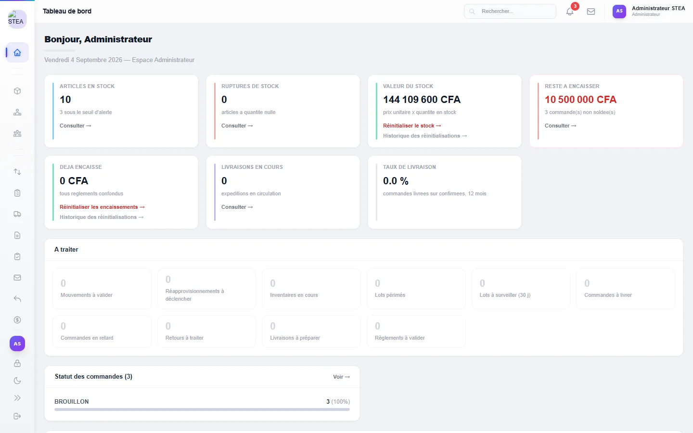
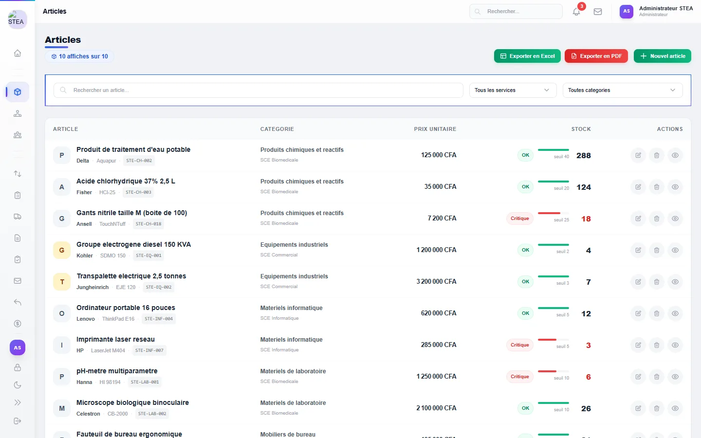
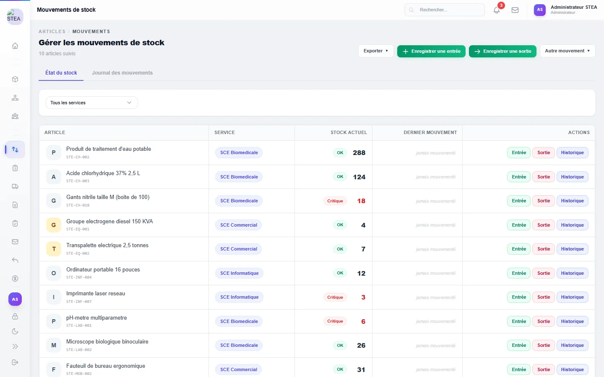
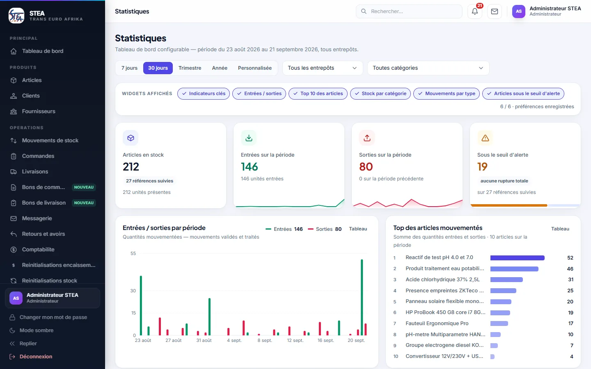
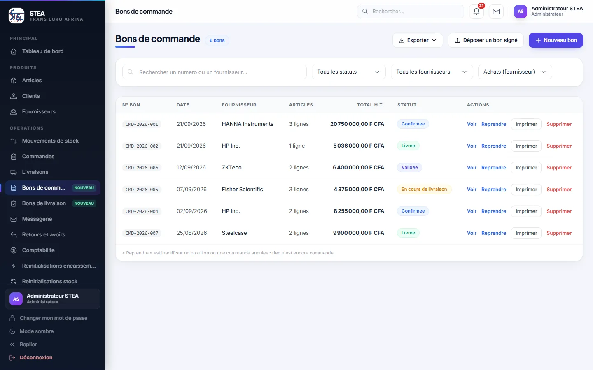
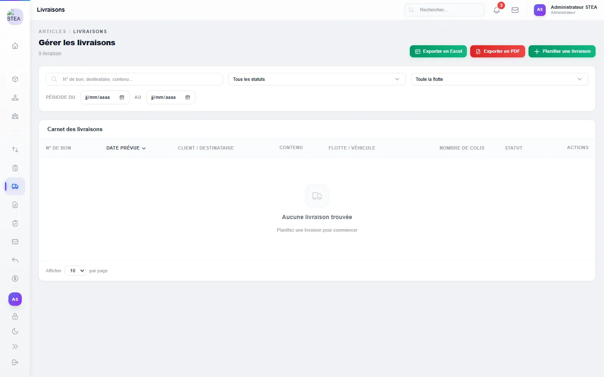
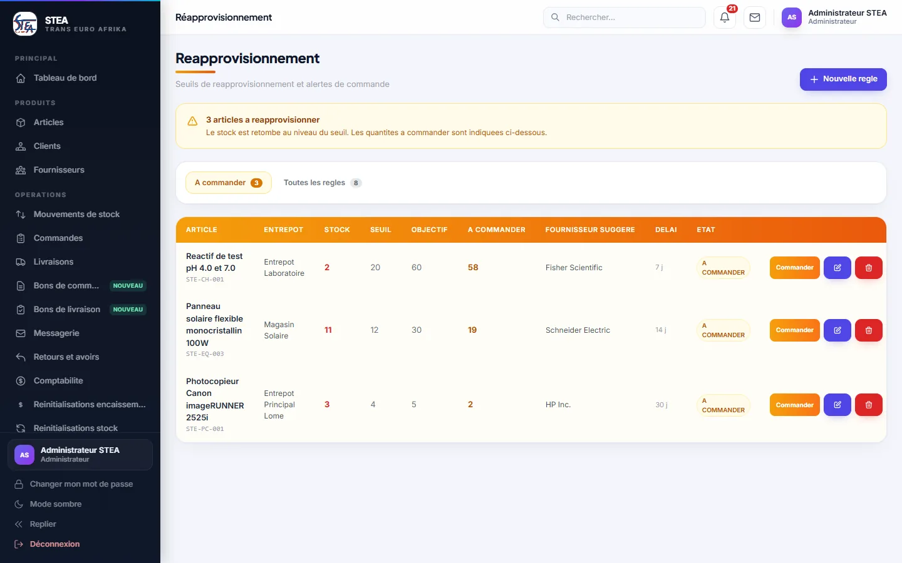
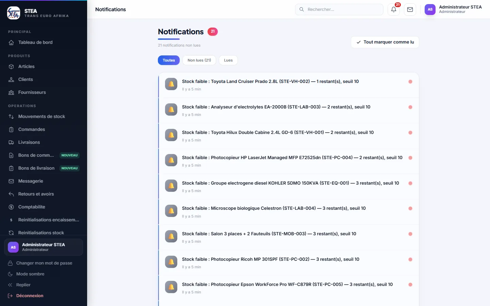
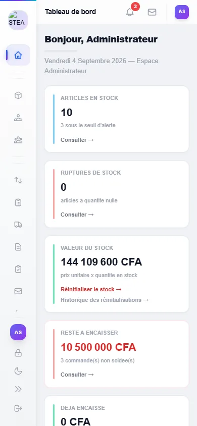

# STEA — Application de bureau Windows

**STEA** est une application de gestion logistique et de suivi des stocks développée pour
**STEA Trans Euro Afrika SARL** (Lomé, Togo), en production depuis août 2026.

Ce dépôt est le **canal de distribution de l'application de bureau** : il héberge les
installeurs Windows dans les [Releases](https://github.com/Ezoolim-Ela/stea-desktop/releases)
et sert les **mises à jour automatiques** (OTA) à tous les postes installés.
Le code source du back-end et de l'interface se trouve dans
[`stea_stock_application`](https://github.com/Ezoolim-Ela/stea_stock_application).

[](https://github.com/Ezoolim-Ela/stea-desktop/releases/latest)
[](https://github.com/Ezoolim-Ela/stea-desktop/releases)

---

## Aperçu

| Tableau de bord | Articles |
| :---: | :---: |
|  |  |

| Mouvements de stock | Statistiques |
| :---: | :---: |
|  |  |

| Bons de commande | Livraisons | Réapprovisionnement | Notifications |
| :---: | :---: | :---: | :---: |
|  |  |  |  |

L'interface s'adapte aussi aux petits écrans (version web embarquée dans le serveur) :



---

## Fonctionnalités

- **Stock multi-entrepôts** avec lots, numéros de série et seuils d'alerte.
- **Achats et ventes** : bons de commande, livraisons, bons de livraison, retours et avoirs.
- **Inventaires** et réinitialisations de stock tracées.
- **Réapprovisionnement** : alertes automatiques de stock critique.
- **Comptabilité** et encaissements, statistiques et rapports exportables.
- **8 rôles utilisateurs** (administrateur, opérateur de stock, logisticien, planificateur
  transport, comptable, agents commercial / biomédical / informatique en consultation seule),
  permissions fines et **journal d'audit**.
- Messagerie interne, notifications, guide d'utilisation intégré.

## En chiffres

| 24 | 8 | 173 | 141 | 29+ |
| :---: | :---: | :---: | :---: | :---: |
| modules métier | rôles utilisateurs | endpoints REST | tests automatisés | versions publiées |

---

## Architecture

```
┌──────────────────────────────┐        HTTPS         ┌──────────────────────────────┐
│  Application de bureau       │ ───────────────────▶ │  Serveur STEA                │
│  Electron + electron-updater │                      │  Spring Boot 3 · Java 17     │
│  embarque l'interface React  │ ◀─────────────────── │  API REST sécurisée par JWT  │
└──────────────┬───────────────┘        JSON          │  MySQL                       │
               │ mises à jour automatiques            └──────────────────────────────┘
               ▼
   GitHub Releases de ce dépôt (latest.yml + STEA-Setup-x.y.z.exe)
```

- **Interface** : React, Tailwind CSS, Recharts — embarquée dans le programme Windows.
- **Serveur** : API REST Spring Boot / MySQL, authentification JWT, rôles et permissions.
- **Distribution** : installeur NSIS construit avec `electron-builder` ; à chaque lancement,
  `electron-updater` compare la version installée à la dernière release et se met à jour
  en tâche de fond.
- **Configuration** : le fichier [`config.json`](config.json) de ce dépôt indique l'adresse
  du serveur ; l'application le lit au démarrage, ce qui permet de changer de serveur sans
  republier de version.

---

## Installation

1. Téléchargez `STEA-Setup-x.y.z.exe` depuis la
   [dernière release](https://github.com/Ezoolim-Ela/stea-desktop/releases/latest).
2. Double-cliquez sur l'installeur. L'installeur n'est pas signé numériquement : si Windows
   affiche « Windows a protégé votre ordinateur », cliquez sur **Informations complémentaires**
   puis **Exécuter quand même**.
3. L'application s'installe sans droits administrateur, crée un raccourci sur le bureau et se lance.
4. Connectez-vous avec le compte fourni par l'administrateur de votre entreprise.

Les versions suivantes s'installent **automatiquement** au lancement suivant : aucune
réinstallation n'est nécessaire.

---

## Auteure

**Ago Ezoolim-Ela** — étudiante en Génie Logiciel & Systèmes d'Information à l'IAI-TOGO.
Conception et développement de l'ensemble : back-end, interface, application de bureau et déploiement.

- Portfolio : https://ezoolim-ela.github.io/Portfolio/
- GitHub : https://github.com/Ezoolim-Ela

## Licence

Logiciel propriétaire développé pour STEA Trans Euro Afrika SARL. Tous droits réservés.
